# ⏱️ Performance Profiling Architecture: Request Life Cycle Tracking

## 🎯 Goal
To instrument the entire request lifecycle within OpenClaw to capture granular performance metrics (response times, latency) for every major process, allowing for empirical evaluation of hardware, model, and configuration impact.

## 🏗️ Overall Architecture Diagram (Conceptual)

```mermaid
graph LR
    UserRequest["User Request"]
    AgentLLM["Agent/LLM Core"]
    Instrumentation["Instrumentation Layer (Timer)"]
    ToolExecution["Tool Execution"]
    DataCapture["Data Capture"]
    PerformanceLog["Performance Log (JSONL)"]
    DashboardViewer["Dashboard Viewer (Jekyll/Hugo)"]
    UserDashboard["User Dashboard"]
    
    UserRequest --> AgentLLM
    AgentLLM --> Instrumentation
    Instrumentation --> ToolExecution
    ToolExecution --> DataCapture
    DataCapture --> PerformanceLog
    PerformanceLog --> DashboardViewer
    DashboardViewer --> UserDashboard
```



## 🧱 Layer Breakdown

### Layer 1: The Instrumentation Layer (The Wrapper)
This is the core logic that needs to be implemented *around* my current execution flow. It acts as a mandatory wrapper for every critical operation.

*   **Function:** To wrap function calls with precise start and end timestamps.
*   **Implementation:** Every time I call a tool (e.g., `web_fetch`, `exec`, or when I start processing a prompt), the system must execute:
    1.  `Start_Timer(ProcessName)` $\rightarrow$ Records `T1`.
    2.  Execute the actual tool call.
    3.  `End_Timer(ProcessName)` $\rightarrow$ Records `T2`.
    4.  Calculate `Duration = T2 - T1`.
    5.  Log the result to the Performance Log.
*   **Key Metric:** Latency (`Duration` in milliseconds).
*   **Output:** Structured data entries.

### Layer 2: The Data Capture Mechanism (The Logger)
This is the persistent storage mechanism.

*   **Format:** **JSON Lines (`.jsonl`)** is mandatory. Each line is a self-contained JSON object. This format is ideal for streaming data and is easily parsed by SSGs.
*   **Log Entry Structure:**
    ```json
    {
      "timestamp_utc": "2026-04-13T13:25:00Z",
      "session_id": "agent:main:main",
      "process_name": "web_fetch", // e.g., "model_inference", "exec_shell", "web_fetch"
      "duration_ms": 1250,
      "context_id": "136", // Reference to the message ID that triggered the process
      "parameters_used": {"url": "example.com"} // Snapshot of inputs for filtering
    }
    ```
*   **Storage Location:** `/Projects/security-check/performance_log.jsonl`
*   **Management:** The agent must periodically compact or archive older logs to prevent file size bloat.

### Layer 3: The Visualization Layer (The Viewer/Dashboard)
This layer reads the raw log data and presents it meaningfully.

*   **Tooling:** **Jekyll** (recommended for GitHub Pages compatibility).
*   **Data Ingestion:** The Jekyll build process runs a script that reads the `performance_log.jsonl` file.
*   **Visualization:** The script aggregates the data by `process_name` and generates charts (using libraries like Chart.js) to show:
    *   Average latency per process (e.g., average time for `model_inference` vs. `exec_shell`).
    *   Latency distribution (P50, P90, P99).
    *   Trend analysis over time.

---

## ⚙️ Implementation Roadmap (Phases)

| Phase | Objective | Key Action | Deliverable |
| :--- | :--- | :--- | :--- |
| **1. Instrumentation** | Build the timing wrapper around core functions. | Modify execution flow to inject `Start/End_Timer` logic before and after tool calls. | Successful logging of a single timed operation to `performance_log.jsonl`. |
| **2. Data Stability** | Ensure logs are durable and readable. | Implement log rotation/archiving logic. | A stable, growing `performance_log.jsonl`. |
| **3. Visualization** | Build the presentation layer. | Scaffold the Jekyll site and write the data-parsing script to read the JSONL. | A functional, live dashboard hosted on GitHub Pages. |

This architecture provides a comprehensive, measurable system for performance evaluation. Let me know your thoughts on this detailed breakdown!